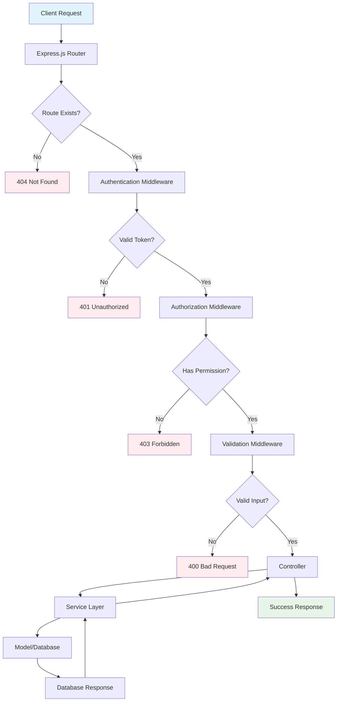
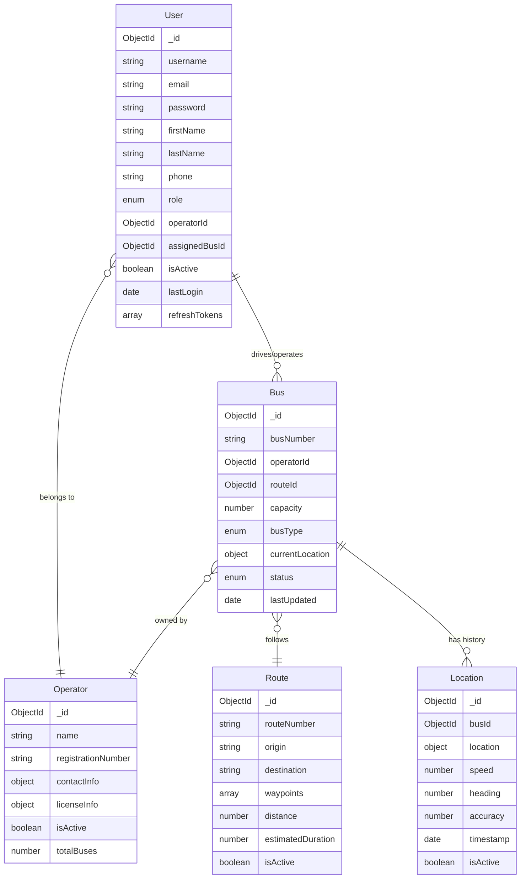
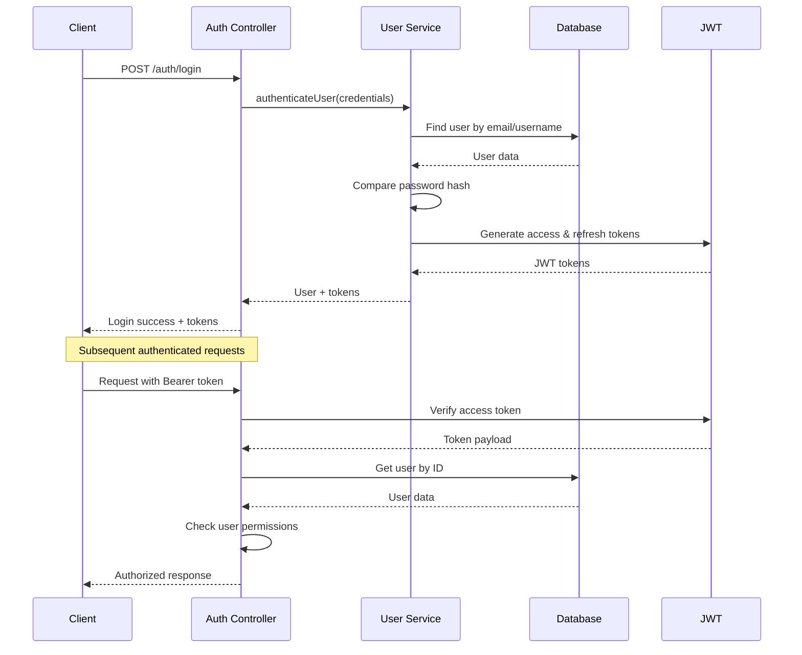

# 🚌 Bus Route API - Real-time GPS Tracking System

[](https://nodejs.org/)
[](https://expressjs.com/)
[](https://www.mongodb.com/)
[](https://jwt.io/)
[](LICENSE)

## 🎯 Project Overview

The **Bus Route API** is a comprehensive real-time GPS tracking system designed for NTC Sri Lanka inter-provincial buses. This RESTful API provides robust fleet management capabilities, real-time location tracking, user authentication with role-based access control, and comprehensive reporting features.

### Key Objectives:

- **Real-time GPS Tracking**: Monitor bus locations and movements in real-time
- **Fleet Management**: Comprehensive management of buses, routes, and operators
- **User Management**: Multi-role user system with secure authentication
- **Geographic Services**: Location-based queries and proximity searches
- **Scalable Architecture**: Service-layer architecture for maintainability and scalability

## ✨ Features

### 🔐 Authentication & Authorization

- JWT-based authentication with access/refresh token system
- Role-based access control (Admin, Operator, Driver, User)
- Secure password hashing with bcrypt
- Session management and token refresh

### 🚌 Fleet Management

- Bus registration and management
- Route planning with waypoints
- Operator management and licensing
- Real-time bus status tracking

### 📍 GPS & Location Services

- Real-time location updates
- Location history tracking
- Geospatial queries (2dsphere indexing)
- Proximity-based bus searches

### 👥 User Management

- Multi-role user system
- Profile management
- Admin dashboard with statistics
- User activity tracking

### 📊 Reporting & Analytics

- Fleet statistics and reports
- User activity analytics
- Operator performance metrics
- Real-time dashboard data

## 🛠 Technology Stack

### Backend

- **Runtime**: Node.js 18.0.0+
- **Framework**: Express.js 5.1.0
- **Database**: MongoDB with Mongoose 8.18.2
- **Authentication**: JWT (jsonwebtoken)
- **Password Hashing**: bcryptjs
- **Validation**: express-validator

### Security & Middleware

- **Security**: Helmet.js for security headers
- **CORS**: Cross-origin resource sharing
- **Compression**: Response compression
- **Logging**: Winston logger with file rotation

### Development Tools

- **Package Manager**: pnpm 10.15.0
- **Environment**: dotenv for configuration
- **Documentation**: Swagger/OpenAPI
- **Process Manager**: Nodemon for development

## 🏗 Project Architecture

The application follows a **Service-Layer Architecture** pattern with clear separation of concerns:

```
┌─────────────────┐    ┌─────────────────┐    ┌─────────────────┐
│   Controllers   │───▶│    Services     │───▶│     Models      │
│  (HTTP Layer)   │    │ (Business Logic)│    │ (Data Layer)    │
└─────────────────┘    └─────────────────┘    └─────────────────┘
         │                       │                       │
         ▼                       ▼                       ▼
┌─────────────────┐    ┌─────────────────┐    ┌─────────────────┐
│   Middleware    │    │    Utilities    │    │    Database     │
│ (Auth, Validation)│    │ (Logger, etc.)  │    │   (MongoDB)     │
└─────────────────┘    └─────────────────┘    └─────────────────┘
```

## 📁 Folder Structure

```
Bus-Route-API/
├── 📄 server.js                 # Application entry point
├── 📄 package.json              # Dependencies and scripts
├── 📄 README.md                 # Project documentation
│
├── 📁 src/                      # Source code directory
│   ├── 📄 app.js                # Express app configuration
│   │
│   ├── 📁 config/               # Configuration files
│   │   ├── 📄 database.js       # MongoDB connection setup
│   │   └── 📄 swagger.js        # Swagger/OpenAPI configuration
│   │
│   ├── 📁 controllers/          # HTTP request handlers
│   │   ├── 📄 authController.js # Authentication endpoints
│   │   ├── 📄 adminController.js# Admin management endpoints
│   │   └── 📄 busController.js  # Bus management endpoints
│   │
│   ├── 📁 middleware/           # Express middleware
│   │   ├── 📄 auth.js           # JWT authentication & authorization
│   │   ├── 📄 errorHandler.js   # Global error handling
│   │   └── 📄 validation.js     # Input validation rules
│   │
│   ├── 📁 models/               # MongoDB/Mongoose models
│   │   ├── 📄 User.js           # User schema and methods
│   │   ├── 📄 Bus.js            # Bus schema and methods
│   │   ├── 📄 Route.js          # Route schema and methods
│   │   ├── 📄 Operator.js       # Operator schema and methods
│   │   └── 📄 Location.js       # Location tracking schema
│   │
│   ├── 📁 routes/               # API route definitions
│   │   ├── 📄 authRoutes.js     # Authentication routes
│   │   ├── 📄 adminRoutes.js    # Admin management routes
│   │   ├── 📄 busRoutes.js      # Bus management routes
│   │   ├── 📄 locationRoutes.js # Location tracking routes
│   │   └── 📄 routeRoutes.js    # Route management routes
│   │
│   ├── 📁 services/             # Business logic layer
│   │   ├── 📄 userService.js    # User management business logic
│   │   ├── 📄 busService.js     # Bus management business logic
│   │   ├── 📄 routeService.js   # Route management business logic
│   │   ├── 📄 locationService.js# Location tracking business logic
│   │   └── 📄 operatorService.js# Operator management business logic
│   │
│   └── 📁 utils/                # Utility functions
│       ├── 📄 logger.js         # Winston logger configuration
│       └── 📄 database.js       # Database utility functions
│
├── 📁 docs/                     # Documentation files
│   └── 📄 swagger.yaml          # OpenAPI specification
│
├── 📁 scripts/                  # Database seeding scripts
│   ├── 📄 seedBuses.js          # Bus data seeding
│   └── 📄 seedRoutes.js         # Route data seeding
│
└── 📁 logs/                     # Application logs
    ├── 📄 combined.log          # All logs
    ├── 📄 error.log             # Error logs only
    ├── 📄 exceptions.log        # Uncaught exceptions
    └── 📄 rejections.log        # Unhandled promise rejections
```

## 🔄 API Request Flow

The following diagram illustrates how API requests flow through the application:



### Request Flow Steps:

1. **🌐 Client Request**: HTTP request arrives at the server
2. **🔀 Router**: Express router matches the request to appropriate route
3. **🔐 Authentication**: JWT token validation (if required)
4. **🛡️ Authorization**: Role-based permission checking
5. **✅ Validation**: Input validation using express-validator
6. **🎮 Controller**: HTTP request handling and response formatting
7. **⚙️ Service**: Business logic processing and data manipulation
8. **💾 Model**: Database operations through Mongoose
9. **📤 Response**: Formatted JSON response sent to client

## 💾 Database Models & Relationships

The application uses MongoDB with Mongoose for data modeling. Here's the entity relationship diagram:



### Model Relationships:

#### 👤 User Model

- **Purpose**: Manages all system users with role-based access
- **Roles**: `admin` | `operator` | `driver` | `user`
- **Relationships**:
  - Belongs to an `Operator` (for operator/driver roles)
  - Can be assigned to a `Bus` (for driver role)

#### 🏢 Operator Model

- **Purpose**: Manages bus operating companies
- **Features**: License tracking, contact information, status management
- **Relationships**:
  - Has many `Users` (operators and drivers)
  - Owns many `Buses`

#### 🚌 Bus Model

- **Purpose**: Represents physical buses in the fleet
- **Features**: Real-time location, status tracking, capacity management
- **Relationships**:
  - Belongs to an `Operator`
  - Follows a `Route`
  - Has location history in `Location` collection

#### 🛣️ Route Model

- **Purpose**: Defines bus routes with waypoints
- **Features**: Geographic waypoints, distance calculation, time estimation
- **Relationships**:
  - Can have multiple `Buses` assigned

#### 📍 Location Model

- **Purpose**: Stores GPS tracking history
- **Features**: Geospatial indexing, speed/heading tracking
- **Relationships**:
  - Belongs to a `Bus`

## 🔐 Authentication & Authorization

### Authentication Flow:



### Role-Based Access Control:

| Role         | Permissions                                              |
| ------------ | -------------------------------------------------------- |
| **Admin**    | Full system access, user management, all CRUD operations |
| **Operator** | Manage own company's buses, drivers, and routes          |
| **Driver**   | Update assigned bus location, view assigned routes       |
| **User**     | View public bus information, track buses                 |

### JWT Token Structure:

```javascript
// Access Token (15 minutes)
{
  "id": "user_id",
  "username": "john_doe",
  "role": "driver",
  "operatorId": "operator_id",
  "iat": 1672531200,
  "exp": 1672532100
}

// Refresh Token (7 days)
{
  "id": "user_id",
  "type": "refresh",
  "iat": 1672531200,
  "exp": 1673136000
}
```

## 🚀 Installation & Setup

### Prerequisites:

- Node.js 18.0.0 or higher
- MongoDB 5.0 or higher
- pnpm 8.0.0 or higher

### Installation Steps:

1. **Clone the repository:**

   ```bash
   git clone https://github.com/SandunTBandara/RouteSync.git
   cd Bus-Route-API
   ```

2. **Install dependencies:**

   ```bash
   pnpm install
   ```

3. **Environment Setup:**

   ```bash
   cp .env.example .env
   # Edit .env with your configuration
   ```

4. **Database Setup:**

   ```bash
   # Start MongoDB service
   # Create database and configure connection string in .env
   ```

5. **Seed Database (Optional):**

   ```bash
   pnpm run seed        # Seed bus data
   pnpm run seed:routes # Seed route data
   ```

6. **Start Development Server:**

   ```bash
   pnpm run dev
   ```

7. **Access API Documentation:**
   Open `http://localhost:3000/api-docs` for Swagger UI

## 🔧 Environment Variables

Create a `.env` file in the root directory:

```env
# Server Configuration
NODE_ENV=development
PORT=3000

# Database Configuration
MONGODB_URI=mongodb://localhost:27017/bus-route-api
MONGODB_TEST_URI=mongodb://localhost:27017/bus-route-api-test

# JWT Configuration
JWT_SECRET=your-super-secret-jwt-key
JWT_REFRESH_SECRET=your-super-secret-refresh-key
JWT_EXPIRE=15m
JWT_REFRESH_EXPIRE=7d

# Security Configuration
BCRYPT_SALT_ROUNDS=12

# Logging Configuration
LOG_LEVEL=info
LOG_DIR=./logs

# CORS Configuration
CORS_ORIGIN=http://localhost:3000
CORS_CREDENTIALS=true

# Rate Limiting
RATE_LIMIT_WINDOW_MS=900000
RATE_LIMIT_MAX_REQUESTS=100

# Swagger Configuration
SWAGGER_ENABLED=true
```

## 📜 Scripts

```json
{
  "start": "node server.js", // Production start
  "dev": "nodemon server.js", // Development mode
  "dev:watch": "nodemon --watch src server.js", // Watch mode
  "seed": "node scripts/seedBuses.js", // Seed bus data
  "seed:routes": "node scripts/seedRoutes.js", // Seed route data
  "test": "jest --coverage", // Run tests
  "test:watch": "jest --watch", // Watch tests
  "lint": "eslint src/ --ext .js", // Code linting
  "lint:fix": "eslint src/ --ext .js --fix", // Fix linting issues
  "format": "prettier --write \"src/**/*.js\"", // Format code
  "health": "curl http://localhost:3000/health" // Health check
}
```

**Made with ❤️ for Sri Lankan public transportation**
