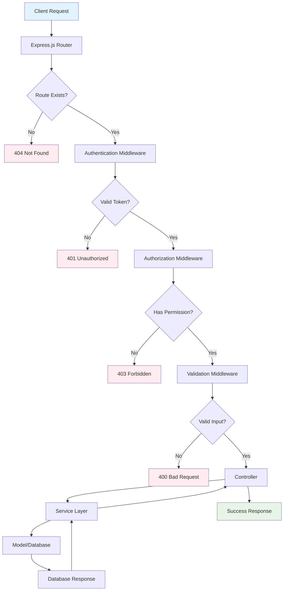
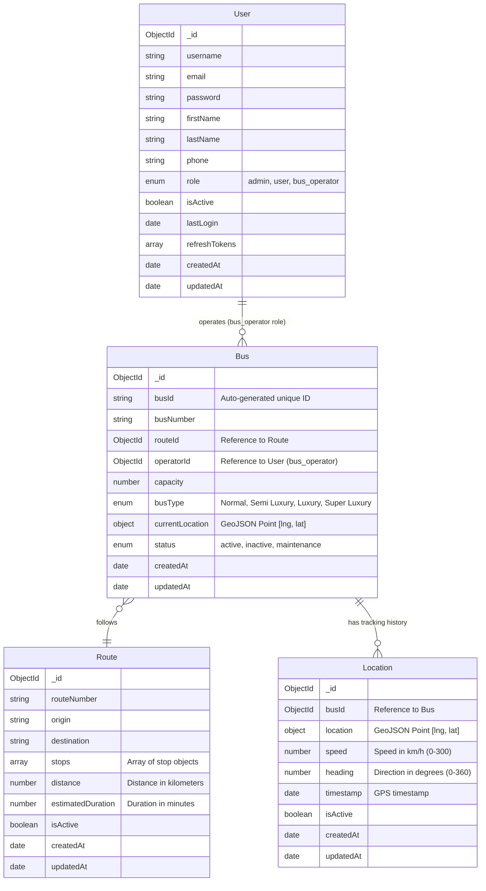
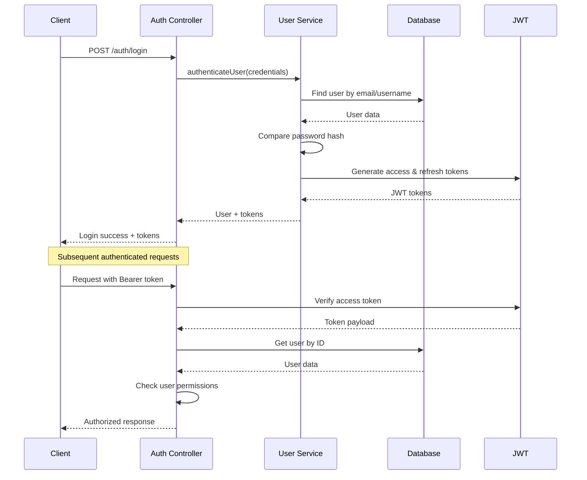

# 🚌 Bus Route API - Real-time GPS Tracking System

[](https://nodejs.org/)
[](https://expressjs.com/)
[](https://www.mongodb.com/)
[](https://jwt.io/)
[](LICENSE)

## 🎯 Project Overview

The **Bus Route API** is a comprehensive real-time GPS tracking system designed for NTC Sri Lanka inter-provincial buses. This RESTful API provides robust fleet management capabilities, real-time location tracking, user authentication with role-based access control, and comprehensive reporting features.

### Key Objectives:

- **Real-time GPS Tracking**: Monitor bus locations and movements in real-time
- **Fleet Management**: Comprehensive management of buses, routes, and operators
- **User Management**: Multi-role user system with secure authentication
- **Geographic Services**: Location-based queries and proximity searches
- **Scalable Architecture**: Service-layer architecture for maintainability and scalability

## ✨ Features

### 🔐 Authentication & Authorization

- JWT-based authentication with access/refresh token system
- Role-based access control (Admin, User, Bus Operator)
- Secure password hashing with bcrypt
- Session management and token refresh
- Comprehensive authorization middleware with resource-level permissions

### 🚌 Fleet Management

- Bus registration and management with operator assignment
- Bus operator creation and management by admins
- Operator-to-bus assignment validation and constraints
- Real-time bus status tracking (active, inactive, maintenance)
- Bus capacity and type management (Normal, Semi Luxury, Luxury, Super Luxury)

### 📍 GPS & Location Services

- **Automated Location Tracking**: Cron-based location updates every 5 minutes
- Real-time location updates by bus operators
- Location history tracking with timestamps
- Geospatial queries with 2dsphere indexing
- Speed and heading calculation from GPS data
- Location validation and error handling

### 👥 User Management

- Three-tier role system (admin, user, bus_operator)
- Bus operator profile management
- Admin dashboard with comprehensive user statistics
- User activity tracking and last login monitoring

### 📊 Reporting & Analytics

- Fleet statistics and comprehensive reports
- User activity analytics and monitoring
- Bus operator performance metrics
- Real-time dashboard data with live updates
- Automated location tracking statistics
- GPS tracking accuracy and coverage reports

### 🤖 Automation & Background Services

- **Automated Location Updater**: Cron-based GPS simulation every 5 minutes
- Realistic GPS coordinate generation for active buses
- Speed and heading calculation algorithms
- Error handling and retry mechanisms for location updates
- System health monitoring and logging

## 🛠 Technology Stack

### Backend

- **Runtime**: Node.js 18.0.0+
- **Framework**: Express.js 5.1.0
- **Database**: MongoDB with Mongoose 8.18.2
- **Authentication**: JWT (jsonwebtoken 9.0.2)
- **Password Hashing**: bcryptjs 3.0.2
- **Validation**: express-validator 7.2.1
- **Automation**: node-cron 3.0.3 for scheduled tasks
- **HTTP Client**: axios 1.12.2 for external API calls

### Security & Middleware

- **Security**: Helmet.js 8.1.0 for security headers
- **CORS**: Cross-origin resource sharing (allows all origins and headers)
- **Compression**: Response compression 1.8.1
- **Logging**: Winston 3.17.0 logger with file rotation

### Development Tools

- **Package Manager**: pnpm 10.15.0
- **Environment**: dotenv 17.2.2 for configuration
- **Documentation**: Swagger/OpenAPI 3.0 with swagger-ui-express 5.0.1
- **Process Manager**: Nodemon 3.1.10 for development
- **Testing**: Jest 30.1.3 with Supertest 7.1.4 for API testing

## 🏗 Project Architecture

The application follows a **Service-Layer Architecture** pattern with clear separation of concerns:

```
┌─────────────────┐    ┌─────────────────┐    ┌─────────────────┐
│   Controllers   │───▶│    Services     │───▶│     Models      │
│  (HTTP Layer)   │    │ (Business Logic)│    │ (Data Layer)    │
└─────────────────┘    └─────────────────┘    └─────────────────┘
         │                       │                       │
         ▼                       ▼                       ▼
┌─────────────────┐    ┌─────────────────┐    ┌─────────────────┐
│   Middleware    │    │   Automation    │    │    Database     │
│(Auth,Validation)│    │  (Cron Jobs)    │    │   (MongoDB)     │
└─────────────────┘    └─────────────────┘    └─────────────────┘
         │                       │                       │
         ▼                       ▼                       ▼
┌─────────────────┐    ┌─────────────────┐    ┌─────────────────┐
│    Utilities    │    │     Logging     │    │   External      │
│ (Logger, Utils) │    │   (Winston)     │    │   Services      │
└─────────────────┘    └─────────────────┘    └─────────────────┘
```

## 📁 Folder Structure

```
Bus-Route-API/
├── 📄 server.js                 # Application entry point
├── 📄 package.json              # Dependencies and scripts
├── 📄 README.md                 # Project documentation
├── 📄 .env                      # Environment variables
├── 📄 .env.example             # Environment template
├── 📄 LOCATION_UPDATER_SETUP.md# Location updater setup guide
│
├── 📁 src/                      # Source code directory
│   ├── 📄 app.js                # Express app configuration
│   │
│   ├── 📁 config/               # Configuration files
│   │   ├── 📄 database.js       # MongoDB connection setup
│   │   └── 📄 swagger.js        # Swagger/OpenAPI configuration
│   │
│   ├── 📁 controllers/          # HTTP request handlers
│   │   ├── 📄 authController.js # Authentication endpoints
│   │   ├── 📄 adminController.js# Admin & bus operator management
│   │   ├── 📄 busController.js  # Bus management endpoints
│   │   ├── 📄 routeController.js# Route management endpoints
│   │   └── 📄 locationController.js # Location tracking endpoints
│   │
│   ├── 📁 middleware/           # Express middleware
│   │   ├── 📄 auth.js           # JWT authentication & authorization
│   │   ├── 📄 errorHandler.js   # Global error handling
│   │   └── 📄 validation.js     # Input validation rules
│   │
│   ├── 📁 models/               # MongoDB/Mongoose models
│   │   ├── 📄 User.js           # User schema (admin/user/bus_operator)
│   │   ├── 📄 Bus.js            # Bus schema with operator assignment
│   │   ├── 📄 Route.js          # Route schema and methods
│   │   └── 📄 Location.js       # Location tracking schema
│   │
│   ├── 📁 routes/               # API route definitions
│   │   ├── 📄 authRoutes.js     # Authentication routes
│   │   ├── 📄 adminRoutes.js    # Admin & bus operator routes
│   │   ├── 📄 busRoutes.js      # Bus management routes
│   │   ├── 📄 routeRoutes.js    # Route management routes
│   │   └── 📄 locationRoutesFinal.js # Location tracking routes
│   │
│   ├── 📁 services/             # Business logic layer
│   │   ├── 📄 userService.js    # User management business logic
│   │   ├── 📄 busService.js     # Bus management business logic
│   │   ├── 📄 routeService.js   # Route management business logic
│   │   └── 📄 locationService.js# Location tracking business logic
│   │
│   └── 📁 utils/                # Utility functions
│       ├── 📄 logger.js         # Winston logger configuration
│       └── 📄 database.js       # Database utility functions
│
├── 📁 scripts/                  # Automation & seeding scripts
│   ├── 📄 autoLocationUpdater.js# Automated location tracking (cron)
│   ├── 📄 LOCATION_UPDATER_README.md # Location updater documentation
│   ├── 📄 seedAll.js            # Seed all data
│   ├── 📄 seedUsers.js          # User data seeding
│   ├── 📄 seedBuses.js          # Bus data seeding
│   ├── 📄 seedRoutes.js         # Route data seeding
│   └── 📄 seedLocations.js      # Location data seeding
│
├── 📁 docs/                     # Documentation files
│   └── 📄 swagger.yaml          # OpenAPI specification
│
└── 📁 logs/                     # Application logs
    ├── 📄 combined.log          # All logs
    ├── 📄 error.log             # Error logs only
    ├── 📄 exceptions.log        # Uncaught exceptions
    └── 📄 rejections.log        # Unhandled promise rejections
```

## 🔄 API Request Flow

The following diagram illustrates how API requests flow through the application:



### Request Flow Steps:

1. **🌐 Client Request**: HTTP request arrives at the server
2. **🔀 Router**: Express router matches the request to appropriate route
3. **🔐 Authentication**: JWT token validation (if required)
4. **🛡️ Authorization**: Role-based permission checking
5. **✅ Validation**: Input validation using express-validator
6. **🎮 Controller**: HTTP request handling and response formatting
7. **⚙️ Service**: Business logic processing and data manipulation
8. **💾 Model**: Database operations through Mongoose
9. **📤 Response**: Formatted JSON response sent to client

## 💾 Database Models & Relationships

The application uses MongoDB with Mongoose for data modeling. Here's the entity relationship diagram:



### Model Relationships:

#### 👤 User Model

- **Purpose**: Manages all system users with role-based access
- **Roles**: `admin` | `user` | `bus_operator`
- **Features**: JWT authentication, password hashing, role validation
- **Relationships**:
  - Can operate a `Bus` (for bus_operator role)
  - Each bus operator can only be assigned to one bus

#### 🚌 Bus Model

- **Purpose**: Represents physical buses in the fleet
- **Features**: Real-time location, status tracking, capacity management, operator assignment
- **Validation**: Ensures operatorId references a user with bus_operator role
- **Relationships**:
  - Belongs to a `User` (bus operator)
  - Follows a `Route`
  - Has location history in `Location` collection

#### 🛣️ Route Model

- **Purpose**: Defines bus routes with stops
- **Features**: Geographic stops, distance calculation, time estimation
- **Relationships**:
  - Can have multiple `Buses` assigned

#### 📍 Location Model

- **Purpose**: Stores GPS tracking history with automated updates
- **Features**: Geospatial indexing, speed/heading tracking, automated cron updates
- **Relationships**:
  - Belongs to a `Bus`

## 🔐 Authentication & Authorization

### Authentication Flow:



### Role-Based Access Control:

| Role             | Permissions                                                                       |
| ---------------- | --------------------------------------------------------------------------------- |
| **Admin**        | Full system access, user management, bus operator management, all CRUD operations |
| **Bus Operator** | Update assigned bus location, view assigned bus data, limited route access        |
| **User**         | View public bus information, track buses, read-only access                        |

### JWT Token Structure:

```javascript
// Access Token (15 minutes)
{
  "id": "user_id",
  "username": "john_doe",
  "role": "bus_operator",
  "iat": 1672531200,
  "exp": 1672532100
}

// Refresh Token (7 days)
{
  "id": "user_id",
  "type": "refresh",
  "iat": 1672531200,
  "exp": 1673136000
}
```

## 🚀 Installation & Setup

### Prerequisites:

- Node.js 18.0.0 or higher
- MongoDB 5.0 or higher
- pnpm 8.0.0 or higher

### Installation Steps:

1. **Clone the repository:**

   ```bash
   git clone https://github.com/SandunTBandara/RouteSync.git
   cd Bus-Route-API
   ```

2. **Install dependencies:**

   ```bash
   pnpm install
   ```

3. **Environment Setup:**

   ```bash
   cp .env.example .env
   # Edit .env with your configuration
   ```

4. **Database Setup:**

   ```bash
   # Start MongoDB service
   # Create database and configure connection string in .env
   ```

5. **Seed Database (Optional):**

   ```bash
   pnpm run seed:users   # Seed user data (including bus operators)
   pnpm run seed:routes  # Seed route data
   pnpm run seed:buses   # Seed bus data with operator assignments
   pnpm run seed:locations # Seed location data
   pnpm run seed         # Seed all data at once
   ```

6. **Start Development Server:**

   ```bash
   pnpm run dev
   ```

7. **Start Automated Location Tracking (Optional):**

   ```bash
   # In a separate terminal
   pnpm run location-updater
   ```

8. **Access API Documentation:**
   Open `http://localhost:3000/api-docs` for Swagger UI

## 🔧 Environment Variables

Create a `.env` file in the root directory:

```env
# Server Configuration
NODE_ENV=development
PORT=3000

# Database Configuration
MONGODB_URI=mongodb://localhost:27017/bus-route-api
MONGODB_TEST_URI=mongodb://localhost:27017/bus-route-api-test

# JWT Configuration
JWT_SECRET=your-super-secret-jwt-key
JWT_REFRESH_SECRET=your-super-secret-refresh-key
JWT_EXPIRE=15m
JWT_REFRESH_EXPIRE=7d

# Security Configuration
BCRYPT_SALT_ROUNDS=12

# Automated Location Tracking
API_BASE_URL=http://localhost:3000/api/v1
LOCATION_UPDATE_INTERVAL=*/5 * * * *
SYSTEM_USERNAME=admin
SYSTEM_PASSWORD=your-admin-password

# Logging Configuration
LOG_LEVEL=info
LOG_DIR=./logs

# CORS Configuration
CORS_ORIGIN=http://localhost:3000
CORS_CREDENTIALS=true

# Rate Limiting
RATE_LIMIT_WINDOW_MS=900000
RATE_LIMIT_MAX_REQUESTS=100

# Swagger Configuration
SWAGGER_ENABLED=true
```

## 📜 Scripts

```json
{
  "start": "node server.js", // Production start
  "dev": "nodemon server.js", // Development mode
  "dev:watch": "nodemon --watch src --ext js,json server.js", // Watch mode
  "seed": "node scripts/seedAll.js", // Seed all data
  "seed:users": "node scripts/seedUsers.js", // Seed user data
  "seed:routes": "node scripts/seedRoutes.js", // Seed route data
  "seed:buses": "node scripts/seedBuses.js", // Seed bus data
  "seed:locations": "node scripts/seedLocations.js", // Seed location data
  "location-updater": "node scripts/autoLocationUpdater.js", // Start location automation
  "location-updater:help": "node scripts/autoLocationUpdater.js --help", // Help for location updater
  "test": "jest --coverage", // Run tests with coverage
  "test:watch": "jest --watch", // Watch tests
  "test:integration": "jest --testPathPattern=tests/integration", // Integration tests
  "lint": "eslint src/ --ext .js", // Code linting
  "lint:fix": "eslint src/ --ext .js --fix", // Fix linting issues
  "format": "prettier --write \"src/**/*.js\"", // Format code
  "validate": "pnpm run lint && pnpm run test", // Validate code quality
  "clean": "rm -rf node_modules pnpm-lock.yaml && pnpm install", // Clean install
  "health": "curl http://localhost:3000/health || echo 'Server not running'" // Health check
}
```

## 🤖 Automated Location Tracking

The system includes an automated location tracking service that simulates GPS updates every 5 minutes:

### Features:

- **Automated Updates**: Cron-based scheduling every 5 minutes
- **Realistic GPS Simulation**: Generates believable coordinates within Sri Lanka
- **Speed Calculation**: Calculates realistic speeds between location updates
- **Error Handling**: Comprehensive error handling and retry mechanisms
- **System Authentication**: Uses admin credentials for automated updates

### Usage:

1. **Start the location updater service:**

   ```bash
   pnpm run location-updater
   ```

2. **Get help and configuration options:**

   ```bash
   pnpm run location-updater:help
   ```

3. **Monitor logs for tracking activity:**
   ```bash
   tail -f logs/combined.log
   ```

### Configuration:

The location updater can be configured via environment variables in `.env`:

- `API_BASE_URL`: Base URL for API calls
- `LOCATION_UPDATE_INTERVAL`: Cron schedule (default: every 5 minutes)
- `SYSTEM_USERNAME`: Admin username for authentication
- `SYSTEM_PASSWORD`: Admin password for authentication

For detailed setup instructions, see `LOCATION_UPDATER_SETUP.md`.

## 🔌 API Endpoints

### 🔐 Authentication Endpoints

```
POST   /api/v1/auth/login          # User login
POST   /api/v1/auth/register       # User registration
POST   /api/v1/auth/refresh        # Refresh JWT token
POST   /api/v1/auth/logout         # User logout
```

### 👤 Admin & User Management

```
GET    /api/v1/admin/users                    # Get all users (Admin only)
POST   /api/v1/admin/bus-operators            # Create bus operator (Admin only)
GET    /api/v1/admin/bus-operators            # Get all bus operators (Admin only)
GET    /api/v1/admin/bus-operators/:id        # Get bus operator by ID (Admin only)
PUT    /api/v1/admin/bus-operators/:id        # Update bus operator (Admin only)
DELETE /api/v1/admin/bus-operators/:id        # Delete bus operator (Admin only)
```

### 🚌 Bus Management

```
POST   /api/v1/buses              # Create bus with operator (Admin only)
GET    /api/v1/buses              # Get all buses
GET    /api/v1/buses/:id          # Get bus by ID
PUT    /api/v1/buses/:id          # Update bus (Admin only)
DELETE /api/v1/buses/:id          # Delete bus (Admin only)
GET    /api/v1/buses/route/:routeId # Get buses by route
```

### 🛣️ Route Management

```
POST   /api/v1/routes             # Create route (Admin only)
GET    /api/v1/routes             # Get all routes
GET    /api/v1/routes/:id         # Get route by ID
PUT    /api/v1/routes/:id         # Update route (Admin only)
DELETE /api/v1/routes/:id         # Delete route (Admin only)
```

### 📍 Location Tracking

```
POST   /api/v1/locations/bus/:busId/update    # Update bus location (Admin/Bus Operator)
GET    /api/v1/locations/bus/:busId/history   # Get location history
GET    /api/v1/locations/bus/:busId/current   # Get current location
GET    /api/v1/locations/nearby               # Get nearby buses
```

### 📊 Health & Documentation

```
GET    /health                    # Health check endpoint
GET    /api-docs                  # Swagger API documentation
```

For complete API documentation with request/response examples, visit `/api-docs` when the server is running.

**Made with ❤️ for Sri Lankan public transportation**
